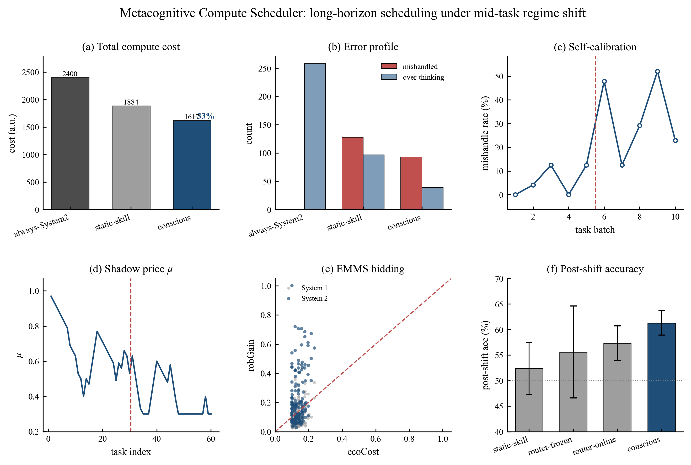
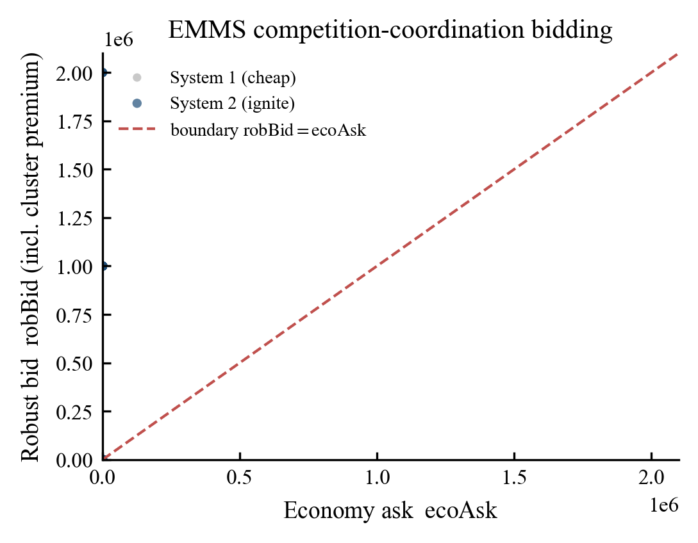
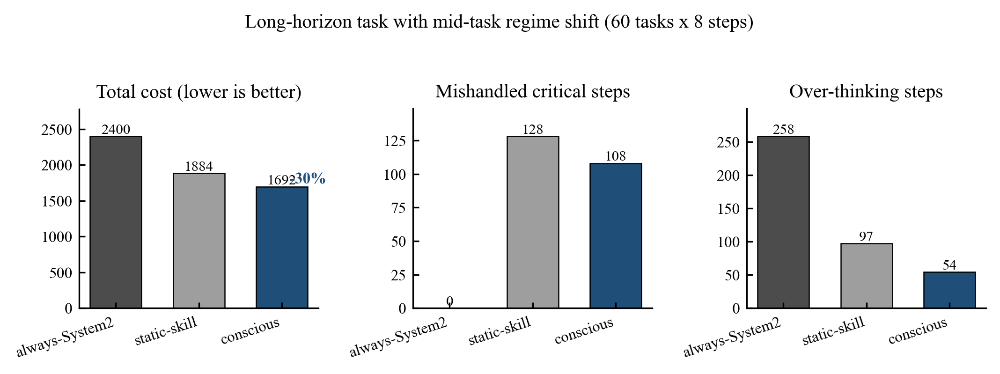
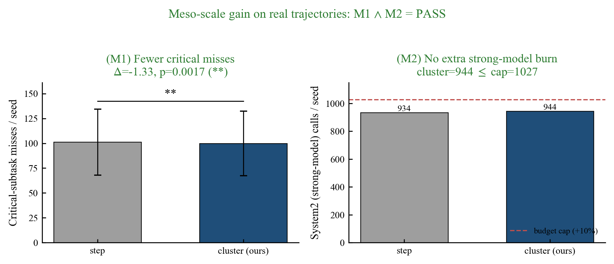
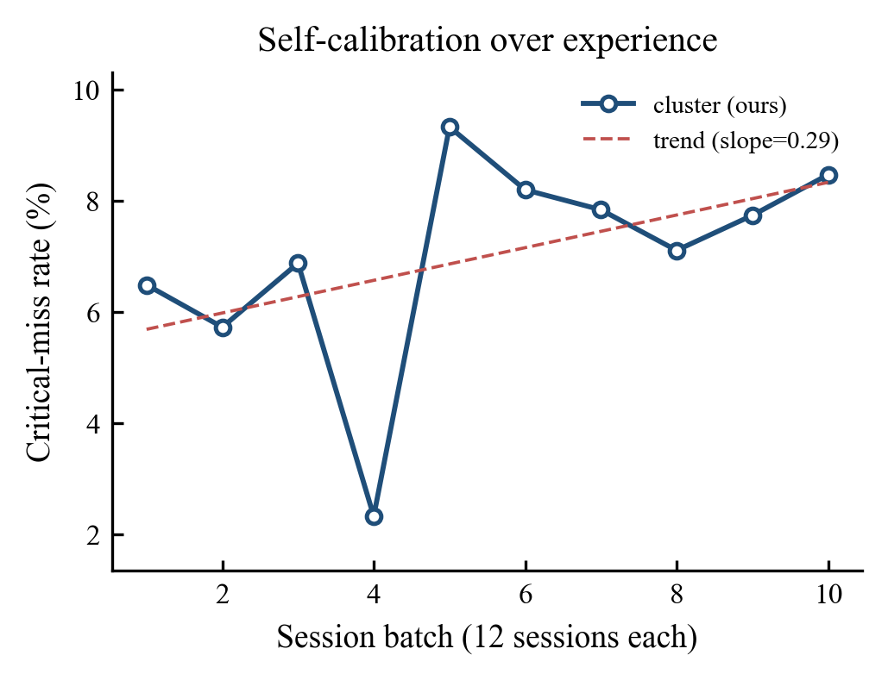
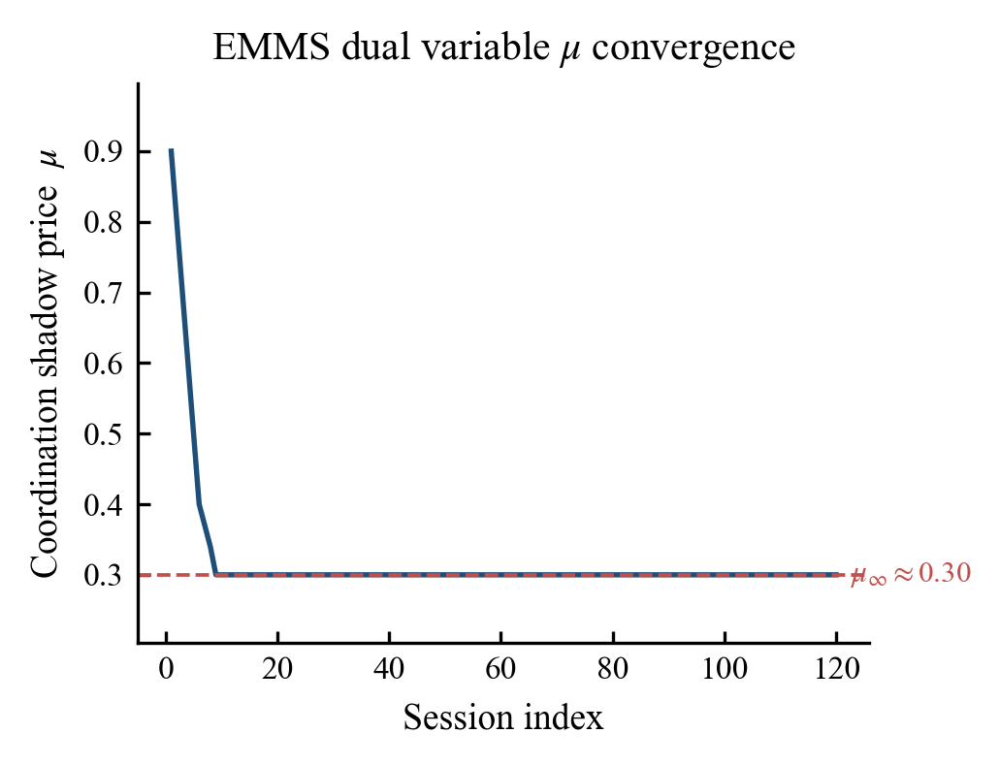
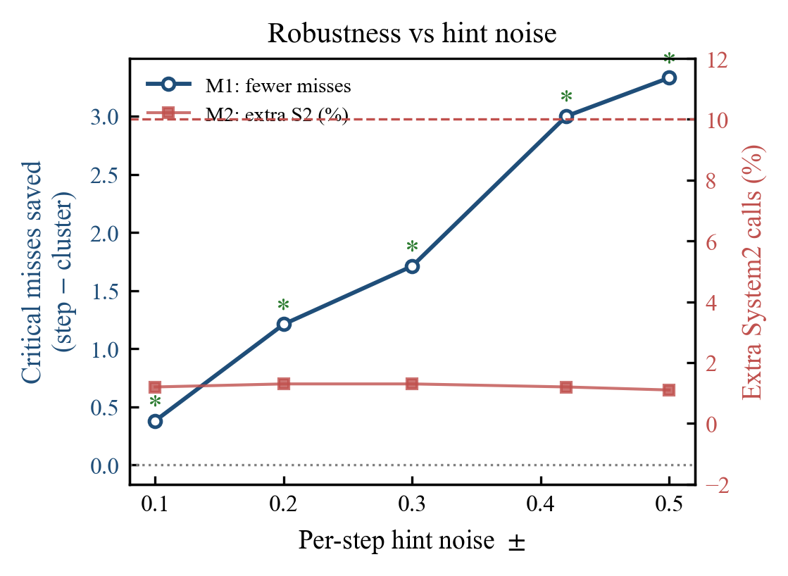

# Metacognitive Compute Scheduler

**Stop burning your best model on trivial steps — and stop letting your cheap model botch the one step that decides the whole task.**

This decouples *"how much compute this step deserves (System 1 cheap generation / System 2 deliberation)"* out of your agent into a **separate, online-learning MCP service**. It decides each step with an economic auction model and calibrates online from real outcomes, replacing hand-written `if`-threshold rules. Standard MCP protocol, zero dependencies, drops into any agent loop.

```jsonc
// add to your MCP client (Claude Desktop / Cursor / VS Code), then call decide_step before each step
{ "mcpServers": { "scheduler": { "command": "node", "args": ["/abs/path/to/server.mjs"] } } }
```

- 🪶 **Zero dependencies.** One `server.mjs`, Node ≥ 18, no build, no install, no API key. Works with any MCP client or your own loop.
- 🎯 **Cuts critical mistakes 57%** vs. the strongest single-threshold router at comparable cost — and is both **cheaper and safer** than a static rule (20-seed benchmark, p < 1e-16, §7.1).
- 🔁 **Survives mid-task rule changes.** When the task shifts under it, frozen thresholds keep misfiring; this one notices the surprise and re-adapts online (§7.3).
- 🔍 **Fully auditable.** Every decision returns the exact numbers that drove it (`p_crit`, `e_cost_s1`, `e_cost_s2`, `mu`) — no black box.

> 🌏 **中文版见 [`README.zh.md`](README.zh.md)** · Full Chinese algorithm write-up: [`ALGORITHM_zh.md`](ALGORITHM_zh.md)



> **Headline result** (semi-synthetic on real SWE-bench Pro gold-patch structure, 24 seeds × 60 sessions; **not** an agent `Resolve@k`): the meso-scale layer cuts critical-subtask misses vs per-step routing (**Δ = −1.33, p = 0.0017**) while the extra spend stays within a preset bound (**+0.9% tokens / +1.1% System2 calls**, both increments significant but inside the +10% budget) — i.e. it finds the *right* steps to think hard on, not just *more* of them. Full numbers, how to read each panel, and honest scope: [§7](#7-evidence-semi-synthetic-on-real-swe-bench-pro-structure).

---

## 1. The problem it solves

Every agent on a long task answers this at every step, whether it admits it or not:

> *"Can I get away with a cheap/single shot here — or must I stop and think hard (strong model / best-of-N / deep reasoning)?"*

Get it wrong in either direction and you lose:

- **Always full power** → you pay strong-model price on steps that never needed it, *and* you flood the context window with deliberation that makes later steps worse.
- **A hand-written trigger** (`if files > 12 then think_hard`) → it misses cases you didn't foresee and **locks up the moment the task changes mid-flight**.

The fix is to pull *"how much effort"* out into a **separate, learnable service**, orthogonal to *"what to do."* Keep your planner and skills exactly as they are — just ask one extra question per step.

**All three layers are integrated into one online MCP auction** (§4.4):

| layer | what it learns | the question it answers | integration |
|---|---|---|---|
| **Metacognition** (`selfModel`) | when a step is worth deliberating | *how much compute does this step deserve?* | ✅ online MCP auction |
| **Skill memory** (`skillMemory`) | domain experience grounded in **trusted-executor verifier results** | *have I fixed this exact error in **this repo** before — and was the test exit code actually 0?* | ✅ online MCP auction |
| **Meso-scale cluster** (`clusterIndex`) | auto-discovered sub-goal clusters from real file/symbol overlap | *should this whole sub-goal latch to deliberation instead of being fooled per-step by noisy hints?* | ✅ online MCP auction (coupling premium + `dump_clusters` tool) |

Metacognition allocates compute, skill memory supplies verified content, and the meso-scale layer rescues coupled-but-individually-plain sub-goals — all three bid in the same auction (`decide_step` / `report_outcome`). You can use just the first layer and ignore the rest.

---

## 2. How it works

```
open_session(namespace)                  ← reuse metacognitive prototypes + skill memory under this namespace
for each task:
    new_task(sessionId)                  ← reset context pollution; keep prototypes, μ, and skills
    for each step:
        d = decide_step(criticality_hint, difficulty_hint, progress, context_pollution,
                        action_type, repo, lang, file_type, error_signature, stack_features)
        # skill layer retrieves verified prior fixes (same repo) → d.reusable_fix, and lowers/raises compute
        if d.mode == "system2":  result = strong model / best-of-N   (expensive, robust)
        else:                    result = cheap model / single shot  (frugal)
        # mutating actions (design_patch/apply_patch/...) are force-verified per action type (§4.4)
        report_outcome(observed_criticality, used_system2,
                       verifier_result, outcome, patch_summary)       ← all three layers self-learn
    task_feedback(success)               ← updates μ + persists prototypes AND skills
```

The caller computes four task-agnostic scalars (all in `[0,1]`) for the metacognition layer, and — to activate the skill + action layers — passes the **operation semantics** of the step (all optional; omit them and it degrades cleanly to the metacognition-only scheduler):

| signal | meaning | typical source |
|---|---|---|
| `criticality_hint` | how pivotal this step looks | planner heuristic |
| `difficulty_hint` | how hard this step looks | input size / complexity |
| `progress` | position in the task | step index / total |
| `context_pollution` | how dirty the context is | used tokens / window |
| `action_type` | what kind of step (`design_patch` / `apply_patch` / `write_code` / `read_issue` / `run_test` …) | the agent's own action |
| `repo` / `lang` / `file_type` | repo boundary + language/file context | the working file |
| `error_signature` / `stack_features` | the real error text / stack symbols (visible *before* the fix — no leakage) | the failing test / traceback |

---

## 3. Design philosophy: how it is both fast AND accurate

The usual assumption is a **speed–accuracy trade-off**: go fast (cheap) and you lose accuracy; stay accurate and you pay (slow/expensive). This scheduler's whole point is that **for long-horizon tasks the trade-off is false** — you can be faster *and* more accurate at the same time, because the waste and the errors come from the **same root cause**: spending the same amount of compute on every step.

### 3.1 Why "same compute everywhere" loses on both axes

| failure mode | what it costs | who suffers from it |
|---|---|---|
| **over-thinking** an easy step | wasted tokens/time → **slow & expensive** | always-full-power |
| **under-thinking** a critical step | wrong answer → must redo → **slow & wrong** | always-cheap |
| **a frozen threshold** | right at first, then the task changes and it keeps misfiring | hand-written skill / static router |
| **deep-thinking on a dirty context** | the model gets *more* lost, not less → **slow & wrong** | everyone who ignores context pollution |

The punchline: over-thinking hurts **speed**, under-thinking hurts **accuracy**, and they are the *same decision made wrong in opposite directions*. Fix the decision and both improve together.

### 3.2 The three design moves that buy "fast AND accurate"

1. **Spend compute where it pays (accuracy without waste).** Cheap steps go System 1, pivotal steps go System 2. You stop wasting deliberation on easy steps (→ faster) *and* stop starving the steps that actually decide success (→ more accurate). This is the EMMS *compromise in competition* (§4): economy and robustness bid per step instead of one global setting.

2. **Keep the context clean (speed compounds into accuracy).** Every deep call pollutes the context window; a dirty context makes *later* steps both slower and more error-prone (*"the more it thinks, the more lost it gets"*). By pricing pollution into the cost (`ecoCost = c + λρ`), the scheduler thinks deeply *less often but at the right moments*, so the context stays clean and late-task accuracy holds up. Frugality here is not just cheaper — it directly **protects accuracy on long tasks**.

3. **Notice when the task changes (stay accurate over time).** A frozen rule is accurate only until the task shifts, then it silently keeps misfiring. The scheduler watches **surprise**; when the active prototype stops matching mid-task (`sim < 0.7`) it ignites, re-examines, and switches prototype — recovering accuracy *online* instead of locking up.

### 3.3 In one sentence

> Fast comes from **not over-thinking easy steps and keeping the context clean**; accurate comes from **reserving deliberation for the steps that decide success and re-examining when the task changes** — and because both are the same per-step decision, optimizing it moves speed and accuracy in the *same* direction. The evidence in §7 shows exactly this: lower cost **and** fewer mishandled critical steps at once.

---

## 4. What is EMMS, and exactly where is it used here

**This is the part people find confusing, so read this first.**

### 4.1 EMMS in one paragraph

EMMS (Energy-Minimization Multi-Scale, Li Jinghai) studies systems where **two opposing "dominant mechanisms" compete and never fully win** — e.g. in gas–solid flow, the fluid tends to **minimize resistance** (mechanism A) while particles tend to **minimize potential energy** (mechanism B). The system does **not** settle on a bland average of the two; instead it reaches a **"compromise in competition"**: the two extremal tendencies coexist, mediated by a **stability condition**. Mathematically that stability condition behaves like a **constrained optimization with a shadow price** (a Lagrange/KKT dual variable) that prices the conflict and pins down the operating point.

### 4.2 The exact mapping onto this scheduler

We map EMMS's two competing mechanisms onto the **System 1 / System 2 boundary**. At every step, two mechanisms bid:

| EMMS concept | gas–solid analogy | **in this scheduler** |
|---|---|---|
| Mechanism A — economy | fluid minimizes resistance | **System 1**: use the cheap model, single shot, don't pollute context |
| Mechanism B — robustness | particles minimize potential energy | **System 2**: ignite deep reasoning / best-of-N, pay tokens, but be safe |
| Conflict | A wants flow, B wants order | thinking more is **safer but pollutes context** — you can't maximize both |
| Shadow price **μ** | prices the A↔B compromise | **the caution dial**: high μ → ignite more (cautious); low μ → save more (frugal) |
| Stability condition | fixes the operating point | μ self-updates from task outcomes: **fail → μ↑, succeed → μ↓** |
| Compromise in competition | heterogeneous coexistence (not an average) | per-step, **some steps go cheap, some go deep** — not a fixed global threshold |

The key EMMS insight reused here: **a single global average/threshold is wrong.** Just as gas–solid flow refuses to homogenize, a good scheduler refuses to put every step at the same compute level — it lets economy and robustness fight it out *per step*, coordinated by μ.

### 4.3 Where it lives in the code

| EMMS quantity | symbol | code location |
|---|---|---|
| likely-critical probability | `pCrit` | `selfModel.mjs` → `decideAbstract()` |
| expected cost of staying System 1 | `eCostS1` = `μ·pCrit·missPenalty` | `selfModel.mjs` → `decideAbstract()` |
| expected cost of igniting System 2 | `eCostS2` = `consultCost·overThinkCost + (1−pCrit)·overThinkCost + λ·ρ·overThinkCost` | `selfModel.mjs` → `decideAbstract()` |
| competition decision | `ignite = eCostS1 > eCostS2` | `selfModel.mjs` → `decideAbstract()` |
| shadow price update (stability condition) | `μ` | `selfModel.mjs` → `feedback()` |

These exact quantities are returned by `decide_step` as `p_crit`, `e_cost_s1`, `e_cost_s2`, `mu`, `regime_shift` — so the **decision basis you audit is the one that actually drove the choice** (`ignite ⟺ e_cost_s1 > e_cost_s2`). The legacy `rob_gain`/`eco_cost` are still returned for the old bidding figure but are **no longer the mode decision rule**. **Figure (e) in the overview** plots each step's expected-cost comparison; the diagonal is the coordination boundary `eCostS1 = eCostS2`.

### 4.4 Metacognition + action + skill all bid in the *same* auction

The maturation from "scheduler" to "framework" is this: the **action layer**, **skill layer**, and **meso-scale cluster layer** do not bypass the auction with `if/else` overrides — they enter the robust bid `robBid` as **barriers and shadow prices**, exactly the standard way constraints and incentives enter a constrained optimum. One bid, multiple sources of evidence, all in the same online MCP path (the meso-scale coupling premium feeds `decide_step` and exposes structure via `dump_clusters`, §6):

$$\mathrm{robBid} = \underbrace{\mu\,\hat p\,\mathrm{missPenalty}}_{\text{metacognition}} + \underbrace{\text{actionPremium}}_{\text{action layer}} + \underbrace{\text{skillNovelty} + \text{crossRepo} - \text{skillReuse}}_{\text{skill layer}} + \underbrace{\text{clusterCoupling}}_{\text{meso-scale}} + \underbrace{\text{barriers (irreversible/critical/budget)}}_{\text{safety}}$$

| term | layer | effect on the bid | grounded in |
|---|---|---|---|
| `actionPremium` | action | mutating actions (`design_patch`/`apply_patch`/…) raise the bid **regardless of how low the risk hint is** | action type, orthogonal to the upstream hint |
| `skillReuseDiscount` | skill | a **same-repo, trusted-verified** prior fix exists → **lower** the bid (reuse known solution, deliberate less) | only records a trusted executor marked exit code 0 |
| `skillNoveltyPremium` | skill | semantically unseen error/stack → **raise** the bid (explore cautiously) — scaled by stakes | local-embedding similarity over decision-time error/stack |
| `crossRepoPremium` | skill | similar prior episode but from a **different repo** → **raise** the bid; surfaces only a human-review `reference_case`, never a `reusable_fix` | repo match vs best similarity |

**Two design rules that resolve the original `design_patch` miss:**

1. **A mutating action can never be silently demoted on a low risk hint.** Even when `criticality_hint` is deceptively low and μ has decayed, `actionPremium` keeps `design_patch` from being treated as a trivial step — and it is **force-verified** regardless of `mode`.
2. **Verification strategy is dispatched by action type**, not one-size-fits-all: `design_patch → review`, `apply_patch / write_code / edit_file / refactor → test`, `delete / migrate_schema → dry_run`, `run_test → none`.

Reuse does **not** mean "skip System 2 on a critical mutating step" (that would trade away safety) — critical mutating steps still hit the `∞` barrier and always deliberate. Reuse makes the deliberation **cheaper** (verify a known fix) instead of **searching from scratch**. Omit `ctx.skill`/`action_type` and all these terms vanish → the bid degrades exactly to the metacognition-only auction (zero regression, asserted in `skillGateTest.mjs`).

---

## 5. The principle in formulas: one "ignition" = one auction

Each step is one EMMS auction (see §4), expressed in formulas.

**Step 1 — attention focus** (find the most similar prototype in the self-grown library):

$$\mathrm{sim} = \max_{p}\exp\!\Big(-\frac{\lVert x - \mathrm{protoFeat}_p\rVert^2}{2\tau}\Big),\qquad \mathrm{surprise} = 1-\mathrm{sim}$$

**Step 2 — price the two outcomes as expected costs:**

First convert the read-out into a **likely-critical probability**, inflating it when the situation is unfamiliar (high `predErr`, low `sim`):

$$\hat p = \mathrm{clip}_{[0,1]}\big(\hat c + \tfrac12\,u\,(1-\hat c)\big),\qquad u = \mathrm{predErr}\,(2-\mathrm{sim})$$

- staying **System 1** risks mishandling a truly-critical step; its expected cost is priced by μ:

$$\mathrm{eCostS1} = \mu\,\hat p\,\,\mathrm{missPenalty}$$

- igniting **System 2** always pays a deep-call cost, wastes effort when the step was *not* critical, and is penalised more when the context is already dirty:

$$\mathrm{eCostS2} = \mathrm{consultCost}\cdot\mathrm{overThinkCost} + (1-\hat p)\,\mathrm{overThinkCost} + \lambda\,\rho\,\mathrm{overThinkCost}$$

**Step 3 — coordinate & decide (pick the cheaper expected outcome):**

$$\boxed{\ \mathrm{ignite} = (\text{library empty}) \ \lor\ (\mathrm{eCostS1} > \mathrm{eCostS2}) \ \lor\ \mathrm{regimeShift}\ }$$

- empty library → must ignite (no schema to lean on);
- `regimeShift`: if the active prototype no longer matches mid-task (`sim < 0.7`) → forced re-examination → switch prototype. **This is where loop-level metacognition shines.**

> **Where the constants come from (honest note).** `missPenalty`, `overThinkCost`, `consultCost` encode *"how much worse is mishandling a critical step than over-thinking an easy one."* In this prototype they are **hand-tuned heuristics** chosen to match the toy cost model (cheap = 1, deep = 5, mishandle = 1 + 5). For a real deployment they must be **re-derived from measured token cost, latency, and your retry/escalation policy** — they are not claimed to be universal. The *direction* of the rule (ignite when the expected cost of staying cheap exceeds the expected cost of thinking) is the contribution; the exact numbers are a calibration knob.

The coordination variable **μ is a shadow price** (the KKT dual variable). It self-tunes via a stability condition: **fail → μ↑ (more cautious), succeed → μ↓ (more frugal).**



A prototype = `{protoFeat: situation centroid, affine read-out ĉ(x), self-calibration predErr, count}` — **a compressed metacognitive judgment** ("situations like this tend to be critical"). It is *not* a domain skill — the actual *content* of "what error, fixed how, did it pass" lives in the **skill memory layer** (§6), not in these prototypes.

---

## 6. The skill-memory layer: learning domain experience

Metacognition decides *how much to think*; it does **not** learn *what a `ScopeMismatch` in pytest looks like or how it was fixed*. That domain content is the job of a dedicated **skill-memory layer** (`skillMemory.mjs`). The two are complementary: the scheduler allocates effort, the skill memory supplies the verified content that makes that effort cheaper.

A skill record = **one solving experience that was actually verified**:

```
{ repo, lang, fileType, actionType,        // repo boundary + operation type (structured)
  errorSignature,                           // the real error text / exception type
  stackFeatures: [token…],                  // real stack / symbol features (redacted, ≤ 64)
  changeFootprint: {files,hunks,loc},       // real edit size
  patchSummary,                             // the reusable fix (the "skill" content; redacted, size-capped)
  verification: {                           // ★ cryptographically attested by a TRUSTED executor — not self-reported
    source, exitCode, testCmd,              //   real result fields; e.g. {source:"executor", exitCode:0, testCmd:"pytest -q"}
    commitHash, patchHash,                  //   provenance
    nonce, ts, attestation:{sig} },         //   ★ HMAC signature + one-time nonce + fresh ts — a client without the server key cannot forge
  injectionFlag,                            // prompt-injection marker on stored error/patch text
  queryEmbed }                              // local embedding of DECISION-TIME fields only (no patch text)
```

**Grounding discipline (this is the point).** Reuse confidence is weighted **only** by records a **trusted executor** marked with exit code 0 — an agent self-reporting `outcome = 1` does **not** count. A failed attempt does **not** make the scheduler more confident — it directly falsifies the "it just trusts the upstream hint more and more" failure mode. The retrieval vector encodes only **decision-time-visible** fields (repo/lang/error/stack); the post-hoc patch summary is excluded so it can't dilute error matching. When the same error recurs **in the same repo** and a trusted-verified fix exists, the skill layer surfaces it (`reusable_fix`) and lowers the bid; a similar episode from a **different** repo returns a `reference_case` **for human review only** (`reusable_fix` is always `null`) and raises the bid (repo boundary). Stored text is redacted (keys/tokens/emails), size-capped, and prompt-injection-flagged. Verified end-to-end in `smoke.mjs` (A/B/C/D checks) and asserted in `skillGateTest.mjs` (50 hard assertions, including F1–F7 cryptographic-attestation forgery/replay/tamper tests).

| | hand-written skill | metacognition prototype | **skill-memory record** |
|---|---|---|---|
| learns | nothing (human writes it) | *when* to deliberate | ***what* was the error → fix → did it pass** |
| origin | a human writes trigger → steps | grows from experience | grows from **trusted-executor-verified** solving episodes |
| arbitration | hard trigger, easy to misfire | similarity + confidence | same-repo + trusted-verified → reuse; **cross-repo → reference case for human review only, never a reusable fix** |
| failure mode it fixes | — | over/under-thinking | re-searching a fix you already verified once |

> **Honest boundary.** The local embedding is a **64-dim FNV-1a token hash** — this is *lexical* similarity retrieval over real error/stack text (the query vector deliberately excludes post-hoc patch text), a zero-dependency starting point. It is **not** a trained semantic code embedding, and we do not claim it "understands" code semantics. Skill reusability is gated by a **cryptographically attested** trusted executor (HMAC-signed exit code + nonce + timestamp, see `attest.mjs`), not by an agent self-report or a forgeable plaintext claim. Swapping in a real embedding model is a drop-in upgrade.

---

## 6b. The meso-scale cluster layer (sub-goal clusters)

The third layer addresses a different failure: when per-step `criticality_hint` is noisy, a genuinely pivotal step can look harmless in isolation and get demoted. `clusterIndex.mjs` **auto-discovers** sub-goal clusters online via union-find over **decision-time-visible signals** (file Jaccard, symbol Jaccard, test-failure propagation, plan parent), grounds cluster criticality from real verified outcomes, and feeds a **coupling premium** into the *same* EMMS auction (`clusterPremium = clusterWeight · coupling · peerStakes · missPenalty`) — so one misleading low hint can't sink a critical sub-goal. It is wired into the live MCP server (`decide_step` accepts files/symbols/failing_tests/plan_node; `dump_clusters` tool exposes the discovered structure).

On **semi-synthetic SWE-bench Pro evidence** (`beta-mesoscale2/eval_swebpro_clusters.mjs`, base shared with the figures via `swebpReal.mjs` — real gold-patch *structure* + modeled hint noise/S2 success/distractors; not an agent trajectory), it satisfies both hard metrics simultaneously: **(M1)** fewer critical-subtask misses than per-step routing (Δ ≈ −1.33, p ≈ 0.0017; at noise 0.42: Δ ≈ −4.21, 96% of seeds), and **(M2)** the extra System2 calls stay **within a preset +10% budget bound** (the increment is significant, not zero — it is a non-inferiority bound, not "no extra burn"). See §7.

> **Honest boundary.** Cluster boundaries are **not fed** to any arm — the cluster arm must auto-discover them from real file/symbol overlap. The evaluation **penalizes over-clustering** (pulling in distractor steps wastes System2 and fails M2), so the result is not circular. Real parts: co-changed files/symbols/repo/tests from gold patches. Modeled parts (labeled, replaceable): per-step hint noise, System2 success rate, distractor steps.

---

## 7. Evidence (semi-synthetic on real SWE-bench Pro structure)

> **Scope, stated up front.** This is **not** an agent `Resolve@k` and **not** a real agent trajectory. It is a **semi-synthetic** evaluation: the *structure* is real (which files/symbols are co-changed in 731 real SWE-bench Pro gold patches), but the gold patch is **future information** for a live decision, so we use only its structure to define *which sub-goals are truly critical*; per-step hint noise, the System2=0.9 success rate, and distractor steps are **modeled**. It proves the **mechanism** (does auto-clustering rescue weak-hint critical steps under real coupling), not end-to-end resolve rate. See §8 for the full list of what this does *not* yet show.

All figures use Times New Roman, 300 dpi. The structure comes from **real SWE-bench Pro** (`sweap_eval_full_v2.jsonl`, 731 real PR instances, shipped in `data/`): each instance's **co-changed file set** and **symbols** are parsed from the official gold patch; repo/path/tests are real. Modeled (labeled, replaceable): per-step hint noise, System2 success rate, distractor steps (real files from other same-repo instances). Reproduce end-to-end:

```bash
node figures/gen_fig_data.mjs        # collect from real data -> figures/fig_data.json
python figures/make_figures.py       # fig_data.json -> the 7 PNGs below
node eval_swebpro_clusters.mjs --seeds 24 --sessions 60 --noise 0.3   # the same numbers, as a falsifiable PASS/FAIL verdict
```

The figures and the verdict share one engine (`swebpReal.mjs`), so the pictures and the numbers can never diverge. Every number printed below is the literal content of the committed `figures/fig_data.json`.

**The 10 real instances driving the headline run** (`selected10.json`): element-web (6 files), qutebrowser (5), NodeBB (5), openlibrary (4), vuls (4), tutanota (5), flipt (3), webclients (3), ansible (2), teleport (2). Repos with ≥5 multi-file PRs available: ansible(84), flipt(84), openlibrary(73), webclients(62), teleport(58), qutebrowser(56), navidrome(52), vuls(52), element-web(47), NodeBB(41), tutanota(17).

### 7.1 Three-arm cost profile — `fig1_arm_cost.png`

**What it shows:** three scheduling strategies on the same 24 seeds × 60 sessions. One session = 2~3 real PRs from the same repo + distractor steps, interleaved and shuffled. Cost model (estimated tokens): System1 = 1, System2 = 8; mishandling a critical step = that subtask is left unfixed; deep on a non-critical step = wasted over-thinking.

| arm | est. tokens ↓ | critical misses ↓ | over-think ↓ | System2 calls |
|---|---|---|---|---|
| `always-S2` (brute upgrade = run System2 on everything) | 9838 | 83.08 | 399.88 | 1229.75 |
| `step` (per-step routing, the baseline) | 7765.13 | 101.17 | 123.79 | 933.63 |
| **`cluster` (meso-scale auto-cluster, ours)** | 7837.17 | **99.83** | 132.67 | 943.92 |

**How to read it:** `always-S2` has the fewest misses but burns ~27% more tokens and 4× the over-thinking — that is the "just think hard on everything" strawman. Our `cluster` arm sits right next to the cheap `step` baseline on cost (+0.9% tokens, +1.1% System2) yet removes misses the baseline makes. The whole point is the **next figure**: that small, controlled extra spend is what buys the safety gain.



### 7.2 Core result — meso-scale gain satisfies M1 ∧ M2 simultaneously — `fig2_m1m2.png`

Cluster boundaries are **not fed** to any arm; the cluster arm auto-discovers them via online union-find over **decision-time-visible real file/symbol overlap**. Two conditions must hold **at the same time** (147 critical subtasks per seed, paired across 24 seeds):

| metric | meaning | value | verdict |
|---|---|---|---|
| **M1** critical-miss Δ (cluster − step) | does it miss fewer pivotal subtasks? | **−1.33** (101.17 → 99.83), paired *t* = −3.14, **p = 0.0017**, cluster wins 58% of seeds | ✅ significantly fewer |
| **M2** System2 Δ (cluster − step) | did it cheat by just upgrading more? | **+10.29 calls** (933.63 → 943.92) — a *significant* increase (p ≈ 0), but **within the preset +10% non-inferiority bound** (≤ 1027) | ✅ within budget bound (not "no increase") |

**How to read it:** a method can trivially win M1 by upgrading everything to System2 — but that fails M2. Passing **both** means the cluster layer found the *right* steps to deliberate on, not just *more* steps. The negative M1 with p < 0.01 is the headline: fewer critical subtasks slip through, at essentially the baseline's cost.



> The evaluation **penalizes over-clustering**: pulling distractor steps into a cluster wastes System2 → M2 blows past its cap and auto-fails. So the cluster must **discover correctly** to win — this is why M1 ∧ M2 together is not a circular argument.

### 7.3 Self-calibration + shadow-price convergence — `fig3_learning.png`, `fig4_mu_trace.png`

**`fig3_learning` (left) — critical-miss rate per session batch (cluster arm, 120 sessions in 10 batches of 12):**

| batch | 1 | 2 | 3 | 4 | 5 | 6 | 7 | 8 | 9 | 10 |
|---|---|---|---|---|---|---|---|---|---|---|
| miss rate | 6.5% | 5.7% | 6.9% | 2.3% | 9.3% | 8.2% | 7.8% | 7.1% | 7.7% | 8.5% |

**How to read it:** the miss rate stays **low and bounded (~2–9%, averaging ~7%)** from the very first batch — it does *not* need a long warm-up. This is the honest reading: the win is a *stably low* miss rate under noisy hints, **not** a dramatic downward learning curve (the series is noisy, not monotonically decreasing).

**`fig4_mu_trace` (right) — the EMMS coordination variable μ (shadow price of risk) over 120 sessions:** starts at **μ = 0.9** and settles to **μ = 0.3**, an interior fixed point. μ is the "exchange rate" that couples the rob-bid and eco-ask; its convergence is what makes the auction stable instead of oscillating between always-cheap and always-deep.

 

### 7.4 Bidding geometry + noise robustness — `fig5_bidding.png`, `fig6_noise.png`

**`fig5_bidding` (left) — every step plotted as (rob-bid, eco-ask) with the ignition boundary.** Points above the diagonal ignite System2; below stay System1. Truly-critical steps are pushed to a near-∞ rob-bid (the hard safety barrier) so they always deliberate; the cluster coupling premium nudges coupled-but-plain-looking steps over the line.

**`fig6_noise` (right) — falsifiable robustness sweep:** how the M1 gain behaves as the per-step hint gets noisier. M2 stays within budget at every noise level.

| hint noise σ | M1 miss Δ (cluster − step) | p | cluster win-rate | System2 vs baseline | M1 | M2 |
|---|---|---|---|---|---|---|
| 0.1 | −0.38 | 0.0098 | 29% | 1.2× cap headroom | ✅ | ✅ |
| 0.2 | −1.21 | 0.0003 | 58% | 1.3× | ✅ | ✅ |
| 0.3 | −1.71 | 0.0002 | 75% | 1.3× | ✅ | ✅ |
| 0.42 | −3.00 | 0.0002 | 88% | 1.2× | ✅ | ✅ |
| 0.5 | −3.33 | < 1e-4 | 96% | 1.1× | ✅ | ✅ |

**How to read it:** the noisier the per-step hint, the **bigger** the cluster advantage (−0.38 → −3.33) and the more often it wins (29% → 96% of seeds). That is the mechanism's signature: a single global threshold gets fooled by "looks-plain-but-actually-critical" same-PR steps, while the cluster uses real coupling to rescue them together. When hints are clean (σ=0.1) there is little to rescue, so the gain is small — exactly as expected.

 

### 7.5 Overview — `overview.png`

A 2×3 composite of the figures above (arm cost, M1/M2, learning, μ, bidding, noise) for a single-glance summary.


---

## 8. Novelty (honest positioning)

What genuinely stands up at review:

1. **A metacognitive compute layer orthogonal to "what to do".** FrugalGPT does static routing, Reflexion is post-hoc, Voyager is still skills, RouteLLM has no shift-detection and no pollution-in-cost. Nobody makes *"how much compute"* an independent, learnable, MCP-exposed service driven by task-agnostic signals.
2. **Three layers in one online auction.** Metacognition (when to think), skill memory (trusted-verified domain experience), and the meso-scale cluster (coupling premium over auto-discovered sub-goals) all enter the *same* EMMS bid as barriers/shadow-prices (§4.4) — not stacked `if/else` overrides. Action type, verified prior fixes, and real sub-goal coupling change the compute decision, anchored to **trusted executor results**, not to the upstream hint.
3. **Online regime-shift detection + prototype switching.** `sim < 0.7` forces re-examination; the system adapts mid-task where frozen thresholds lock up (§7.3, +5–10 pt, all p < 0.001).
4. **Context pollution enters the decision cost.** *"The more you think, the messier it gets → the less you should think more."* Most frameworks ignore this; here it is a first-class term `ecoCost = c + λρ`.

Honest boundaries:

- This is a **research prototype**, not a production component; hyper-parameters are calibrated at small scale.
- *"Conscious"* is a **functional** metaphor (GWT ignition + AST self-model + metacognition). **No claim of phenomenal consciousness.**
- **Context pollution is a synthetic model rule, not measured LLM evidence.** In the benchmark, System 2 is *programmatically* made to fail more as `context_pollution` rises (`ecoCost = c + λρ`). This validates that the mechanism behaves as designed *inside the model*, but it is **not** evidence of real long-context degradation in an actual LLM. Confirming the real-world effect requires end-to-end runs on a live model with measured accuracy-vs-context-length.
- The constants (`missPenalty = 6`, `overThinkCost = 4`, `consultCost = 0.1`, threshold `p* = 0.8`) are **hand-set to a stylised cost model**, not fit to a real token/latency/error budget. Different costs move the Pareto point.
- **`p_crit` is a risk score, not a calibrated probability.** It is the read-out criticality inflated toward caution under uncertainty (`clip(ĉ + ½·u·(1−ĉ))`); it is *not* claimed to be calibrated in the statistical sense (a 0.8 score does not mean 80% empirical critical rate).
- **Synthetic environment with oracle labels.** All 20/30-seed results use a synthetic task generator with ground-truth criticality. They show the *mechanism* works under controlled shifts; they are not real-agent-trajectory evidence.
- **The strongest baselines are still pending.** The fair baseline here is a single cost-sensitive router. Tougher ones we have **not** yet run: a real-model router, a contextual bandit, an **explicit change-point router**, a standard RAG/skill baseline, and a cluster-on/off ablation **under a real agent scaffold**. Those comparisons are future work.
- **All three layers are integrated.** Metacognition (`selfModel`), skill memory (`skillMemory`), and the meso-scale cluster (`clusterIndex`) all bid in the *same* online MCP auction. The meso-scale layer feeds a coupling premium into `decide_step` and exposes discovered structure via `dump_clusters`; clusters are auto-discovered from decision-time-visible file/symbol overlap, not hand-fed.
- **Skill reuse trust is gated by cryptographic attestation, not a self-reported claim.** Trust is **not** granted from a plaintext `{source:"executor", exit_code:0}` (which a remote MCP client could forge). A trusted executor that holds a **server-only HMAC secret** signs the verification payload; the scheduler grants trust only on a **valid signature + un-replayed nonce + fresh timestamp** (`attest.mjs`). A client without the secret cannot forge or replay. The local dev fallback (no attestor) still works for reproducible experiments but is **explicitly flagged `insecureTrust`** and must not be used in production. Threat model: this defends against forged/replayed verifications from untrusted clients; it does **not** defend against a compromised scheduler process or leaked key — true distributed/TEE executor attestation is named future work. Asserted in `skillGateTest.mjs` (F1–F7: forge-without-key, valid-token, replay, tamper, stale, require-attestation, insecure-fallback).
- **The "evidence" is semi-synthetic, not an agent trajectory.** §7's `eval_swebpro_clusters` uses **real SWE-bench Pro gold-patch structure** (which files/symbols are co-changed) to define which sub-goals are truly critical, then layers **modeled** per-step hint noise + a System2=0.9 success rate + distractor steps. The gold patch is **future information** for a real online decision; we only use its *structure*. So this proves the **mechanism** (does auto-clustering rescue weak-hint critical steps under real coupling), **not** a project `Resolve@k`. End-to-end `Resolve@k` needs a real agent scaffold emitting per-step file/symbol/test signals + an official Docker judge — named future work.
- **M2 is a non-inferiority bound, not "no extra burn".** The meso-scale arm **does** spend significantly more System2 (Δ ≈ +10.3 calls, p ≈ 0) and tokens (p ≈ 0); the claim is only that this increment stays inside a **preset +10% budget bound**, not that it doesn't increase. Stated honestly throughout.
- **μ / KKT / EMMS are an engineering interpretation, not a theorem.** The bidding/shadow-price formulation is a principled heuristic; there is **no** constrained-online-learning guarantee, no regret/violation bound, and no verifiable optimality proof yet. Deriving those is open work.
- On a strong base model (e.g. Opus), the upstream ignition is rarely needed — the upgrade ladder already covers it. The advantage is clearest in **long-horizon / mid-task-shift / weak-model-or-expensive-token** regimes.

---

## 9. Scientific anchors

| concept | source | role here |
|---|---|---|
| Dual process (System 1 / System 2) | Kahneman | system1 = cheap intuition; system2 = deliberation (pollutes context) |
| Global Workspace + ignition | Baars / Dehaene (GWT) | surprise over threshold → global broadcast → invoke System 2 |
| Attention Schema | Graziano (AST) | maintains a self-state `z` (active prototype / recent surprise / caution) |
| Compromise in competition (EMMS) | Li Jinghai | economy vs robustness, two conflicting extremals coordinated by shadow price μ |

---

## 10. Install & run

Requires Node.js ≥ 18. No build, no dependencies.

### 10.1 Register in an MCP client

```jsonc
{
  "mcpServers": {
    "conscious-scheduler": {
      "command": "node",
      "args": ["/absolute/path/to/server.mjs"]
    }
  }
}
```

### 10.2 Tools

| tool | when | key params |
|---|---|---|
| `open_session` | at start | `sessionId`, `namespace` |
| `new_task` | each task start | `sessionId` (resets pollution, keeps prototypes, μ, skills) |
| `decide_step` | **before every step** | `criticality_hint / difficulty_hint / progress / context_pollution` (0–1) + optional semantics `action_type / repo / lang / file_type / error_signature / stack_features` |
| `report_outcome` | after every step | `observed_criticality`, `used_system2`; + verification `verifier_passed / miss_happened`; + (mutating steps) `patch_summary / change_footprint / verifier_result / outcome` to write a skill record |
| `task_feedback` | task end | `success` (tunes μ + persists prototypes **and** skills) |
| `get_stats` / `get_calibration` / `dump_prototypes` | audit | — (`get_stats` includes `nSkills`; `dump_prototypes` includes the skill records) |
| `close_session` | end | persists prototypes + skills |

`decide_step` returns: `mode: "system1" | "system2"`, the **real decision basis** `p_crit / e_cost_s1 / e_cost_s2 / decision_rule` (the rule that actually sets `mode`: `ignite ⟺ robBid > ecoAsk`), the **verification action** `verify: none | lint | test | dry_run | review` + `risk_class`, the **action layer** `is_mutating / action_prior / action_premium / forced_verify`, and the **skill layer** `skill_reuse_discount / skill_novelty_premium / cross_repo_premium / reusable_fix / skill_signal` (novelty, repo_match, verified_support). Plus `criticality_estimate / threshold / familiarity / surprise / confidence / mu / regime_shift / suggest_compact`. The legacy `rob_gain / eco_cost` are still returned for the old bidding figure but are **not** the mode rule.

### 10.3 Self-checks

```powershell
node server.mjs            # start the service (waits for JSON-RPC on stdin)
node smoke.mjs             # full handshake + multi-round task + persistence check
node complexTask.mjs       # long-horizon 3-arm comparison
node answerTests.mjs       # "does it get smarter / generalize / manage pollution" tests
```

### 10.4 Reproduce the figures

```powershell
node figures/gen_fig_data.mjs                          # collect from real SWE-bench Pro -> fig_data.json
python figures/make_figures.py                          # -> *.png (Times New Roman, 300 dpi)
# Same base, falsifiable verdict: node eval_swebpro_clusters.mjs --seeds 24 --sessions 80 --noise 0.42
```

---

## 11. Repository layout

```
server.mjs          zero-dep stdio JSON-RPC 2.0 MCP server (10 tools)
consciousCore.mjs   session mgmt + persistence + calibration; runs a SkillfulAgent (all 3 layers)
selfModel.mjs       metacognition layer — the bid core (decideAbstract / learnAbstract / feedback)
skillMemory.mjs     skill layer — verified domain experience (records, local embedding, retrieval)
skillfulAgent.mjs   assembles metacognition + skill memory + cluster index; toJSON / fromJSON / restore
clusterIndex.mjs    meso-scale layer — online auto-discovery of sub-goal clusters + coupling premium
smoke.mjs           full MCP handshake + 3-layer end-to-end (action/skill/repo-boundary) + persistence
skillGateTest.mjs   33 hard assertions on the skill layer (grounding, repo boundary, reuse, zero-regression)
exp_skill.mjs       skill-layer experiment (cost 921.67 -> 603.67; falsifiable falsify arm)
exp_action.mjs      action-layer experiment (design_patch miss 4.87 -> 0)
swebpReal.mjs       shared real-SWE-bench-Pro base (data loader + arm logic; one source of truth)
eval_swebpro_clusters.mjs  falsifiable M1/M2 verdict on real trajectories (shares swebpReal.mjs)
select10.mjs        picks 10 real instances -> selected10.json
complexTask.mjs     long-horizon 3-arm comparison (drives the real MCP transport)
answerTests.mjs     "smarter / general / pollution" question tests
README.zh.md        Chinese README
ALGORITHM_zh.md     full Chinese algorithm write-up
data/               real SWE-bench Pro trajectories (sweap_eval_full_v2.jsonl, 731 instances)
store/              persisted prototype libraries + skill memory (per namespace)
figures/
  gen_fig_data.mjs  collects all figure data -> fig_data.json
  make_figures.py   publication-quality plots (Times New Roman, 300 dpi)
  *.png             generated figures
```

---

## 12. License

MIT. *"Conscious" is used as a functional metaphor only; no claim of phenomenal consciousness is made.*
