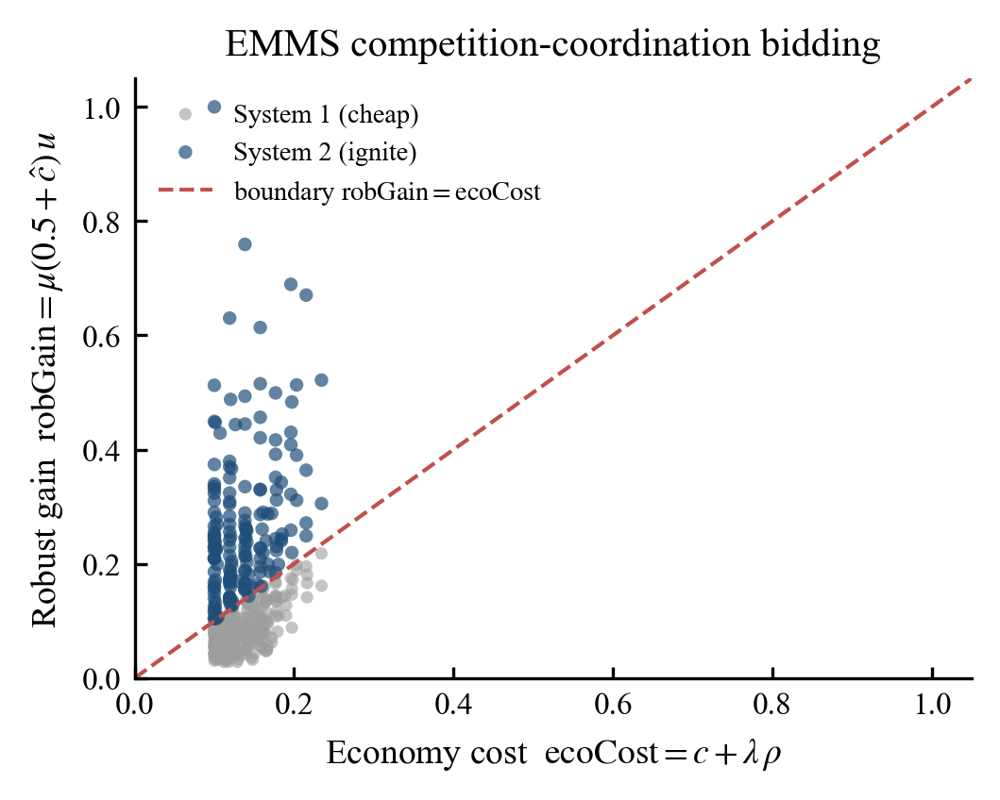
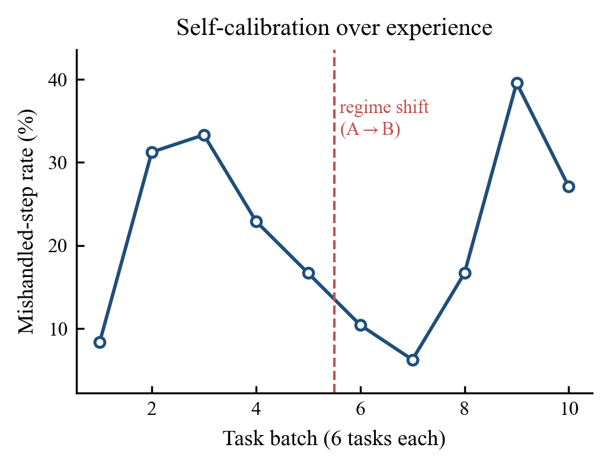
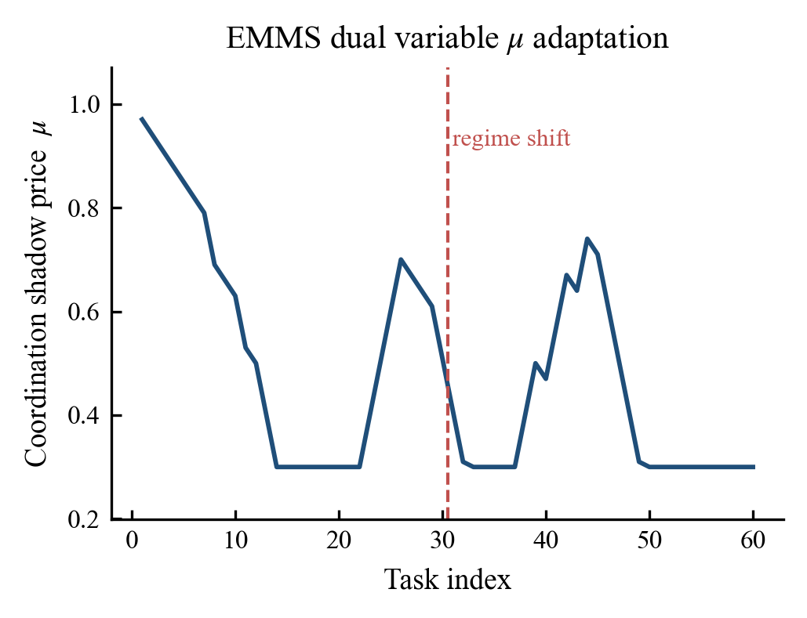
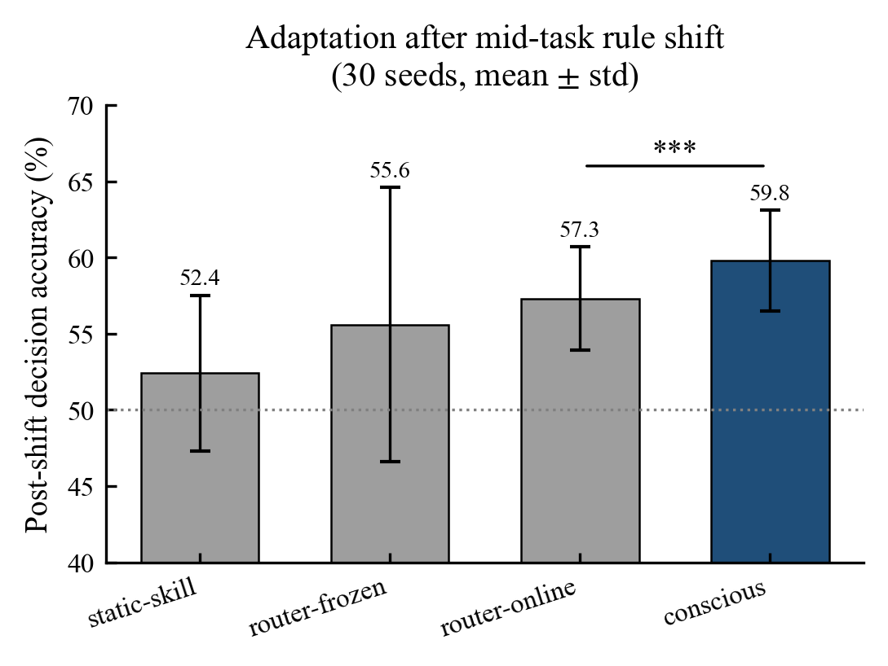

# Metacognitive Compute Scheduler

> An MCP (Model Context Protocol) service that decides **how much compute each step of an agent deserves** — cheap intuition (System 1) or expensive deliberation (System 2) — and learns that judgment from experience instead of hand-written rules.
>
> 一个 MCP 工具：它不决定"做什么步骤"，只决定"**这一步该用多大算力**"——便宜糊弄（System 1）还是停下来深想（System 2）。而且这个判断是从经验里自己长出来的，不是写死的规则。

Zero-dependency Node.js (ESM). Works with any MCP client (Claude Desktop / Cursor / VS Code / your own agent loop).

> 中文算法详解见 [`ALGORITHM_zh.md`](ALGORITHM_zh.md)。


---

## 1. What it is / 是什么

Every agent running a long-horizon task is implicitly answering, at every step:

> *"Can I get away with a cheap model / single shot here, or must I stop and think hard (strong model / best-of-N / deep reasoning)?"*

Most frameworks do one of two bad things:

- **Always full power** — expensive, and it keeps polluting the context window.
- **Hand-written skill triggers** (`if files > 12 then think_hard`) — they miss unforeseen cases and lock up when the task changes mid-flight.

This project pulls that *"how much effort"* decision out into a **separate, learnable service**. It is **orthogonal** to *"what to do"*: keep your planner/skills, just ask this service one question per step — *System 1 or System 2?*

这件事独立成一个所有 agent 都能调用的服务，与"做什么"正交。你照常用你的 planner，只在每步问它一句。

---

## 2. How it works / 怎么工作

```
open_session(namespace)                  ← reuse skills accumulated under this namespace
for each task:
    new_task(sessionId)                  ← reset context pollution; keep prototypes & μ
    for each step:
        d = decide_step(criticality_hint, difficulty_hint, progress, context_pollution)
        if d.mode == "system2":  result = strong model / best-of-N   (expensive, robust)
        else:                    result = cheap model / single shot  (frugal)
        report_outcome(observed_criticality, used_system2)           ← the core self-learns
    task_feedback(success)               ← updates μ + persists skills
```

The caller only ever computes four task-agnostic scalars (all in `[0,1]`):

| signal | meaning | typical source |
|---|---|---|
| `criticality_hint` | how pivotal this step looks | planner heuristic |
| `difficulty_hint` | how hard this step looks | input size / complexity |
| `progress` | position in the task | step index / total |
| `context_pollution` | how dirty the context is | used tokens / window |

---

## 3. What is EMMS, and exactly where is it used here / EMMS 是什么，到底用在了哪里

**This is the part people find confusing, so read this first.** / **这一节专门讲清楚最容易看不懂的地方。**

### 3.1 EMMS in one paragraph / 一段话讲清 EMMS

EMMS (Energy-Minimization Multi-Scale, 李静海) studies systems where **two opposing "dominant mechanisms" compete and never fully win** — e.g. in gas–solid flow, the fluid tends to **minimize resistance** (mechanism A) while particles tend to **minimize potential energy** (mechanism B). The system does **not** settle on a bland average of the two; instead it reaches a **"compromise in competition"** (竞争中的协调): the two extremal tendencies coexist, mediated by a **stability condition**. Mathematically that stability condition behaves like a **constrained optimization with a shadow price** (a Lagrange/KKT dual variable) that prices the conflict and pins down the operating point.

EMMS 研究的是这样一类系统：**两个相互对立的"主导机制"竞争、谁也无法独占**——比如气固两相流里，流体倾向**最小化阻力**（机制 A），颗粒倾向**最小化势能**（机制 B）。系统**不会**停在两者的温吞平均，而是达到一种**"竞争中的协调"**：两个极端倾向共存，由一个**稳定性条件**居中裁决。这个稳定性条件在数学上等价于**带影子价（拉格朗日/KKT 对偶变量）的约束优化**——影子价给"冲突"定价，从而定出工作点。

### 3.2 The exact mapping onto this scheduler / 在本调度器里的精确对应

We map EMMS's two competing mechanisms onto the **System 1 / System 2 boundary**. At every step, two mechanisms bid:

我们把 EMMS 的两个竞争机制，搬到 **System 1 / System 2 的边界**上。每一步，两个机制出价竞争：

| EMMS concept | gas–solid analogy | **in this scheduler** |
|---|---|---|
| Mechanism A — economy (省) | fluid minimizes resistance | **System 1**: use the cheap model, single shot, don't pollute context |
| Mechanism B — robustness (稳) | particles minimize potential energy | **System 2**: ignite deep reasoning / best-of-N, pay tokens, but be safe |
| Conflict | A wants flow, B wants order | thinking more is **safer but pollutes context** — you can't maximize both |
| Shadow price **μ** | prices the A↔B compromise | **the caution dial**: high μ → ignite more (cautious); low μ → save more (frugal) |
| Stability condition | fixes the operating point | μ self-updates from task outcomes: **fail → μ↑, succeed → μ↓** |
| Compromise in competition | heterogeneous coexistence (not an average) | per-step, **some steps go cheap, some go deep** — not a fixed global threshold |

The key EMMS insight reused here: **a single global average/threshold is wrong.** Just as gas–solid flow refuses to homogenize, a good scheduler refuses to put every step at the same compute level — it lets economy and robustness fight it out *per step*, coordinated by μ.

这里复用的 EMMS 核心洞见是：**单一的全局平均/阈值是错的。** 就像气固流拒绝均匀化，好的调度器也拒绝把每一步都设成同一个算力档——它让"省"和"稳"在*每一步*上较量，由 μ 协调。

### 3.3 Where it lives in the code / 它落在代码哪里

| EMMS quantity | symbol | code location |
|---|---|---|
| robustness bid (System 2 gain) | `robGain` | `selfModel.mjs` → `decideAbstract()` |
| economy bid (System 1 cost) | `ecoCost` | `selfModel.mjs` → `decideAbstract()` |
| competition decision | `ignite = robGain > ecoCost` | `selfModel.mjs` → `decideAbstract()` |
| shadow price update (stability condition) | `μ` | `selfModel.mjs` → `feedback()` |

These exact quantities are returned by `decide_step` as `rob_gain`, `eco_cost`, `mu`, `regime_shift` — so you can watch the EMMS auction happen live. **Figure (e) below is literally this auction**: each point is one step's `(ecoCost, robGain)`; the diagonal is the coordination boundary `robGain = ecoCost`.

`decide_step` 会把这些量原样返回（`rob_gain` / `eco_cost` / `mu` / `regime_shift`），你能实时看到这场 EMMS 竞价。**下面的图 (e) 画的就是这场竞价**：每个点是某一步的 `(ecoCost, robGain)`，对角线就是协调边界 `robGain = ecoCost`。

---

## 4. The principle in formulas / 原理公式：one "ignition" = one auction

Each step is one EMMS auction (see §3), expressed in formulas. / 每一步就是一场 §3 描述的 EMMS 竞价，用公式写出来如下。

**Step 1 — attention focus** (find the most similar prototype in the self-grown library):

$$\mathrm{sim} = \max_{p}\exp\!\Big(-\frac{\lVert x - \mathrm{protoFeat}_p\rVert^2}{2\tau}\Big),\qquad \mathrm{surprise} = 1-\mathrm{sim}$$

**Step 2 — two mechanisms bid:**

- The **robust** mechanism (System 2) wants to ignite; its gain rises with *"likely critical × uncertain"*:

$$\mathrm{robGain} = \mu\,(0.5 + \hat c)\,u,\qquad u = \mathrm{predErr}\,(2-\mathrm{sim})$$

- The **economy** mechanism (System 1) wants to save; its cost = fixed consult cost + context-pollution penalty (the dirtier the context, the less you should think more — avoids *"the more it thinks, the more lost it gets"*):

$$\mathrm{ecoCost} = c + \lambda\,\rho$$

**Step 3 — coordinate & decide:**

$$\boxed{\ \mathrm{ignite} = (\text{library empty}) \ \lor\ (\mathrm{robGain} > \mathrm{ecoCost}) \ \lor\ \mathrm{regimeShift}\ }$$

- empty library → must ignite (no schema to lean on);
- `regimeShift`: if the active prototype no longer matches mid-task (`sim < 0.7`) → forced re-examination → switch prototype. **This is where loop-level metacognition shines.**

The coordination variable **μ is a shadow price** (the KKT dual variable). It self-tunes via a stability condition: **fail → μ↑ (more cautious), succeed → μ↓ (more frugal).**



A prototype = `{protoFeat: situation centroid, affine read-out ĉ(x), self-calibration predErr, count}` — essentially **a skill compressed into intuition**.

---

## 5. Why this can replace hand-written skills / 为什么能替代 skill

| | hand-written skill | this (prototype library) |
|---|---|---|
| origin | a human writes it (trigger → fixed steps) | **grows from experience** (unexplained situation → new prototype = writes its own skill) |
| generalization | only fires on foreseen cases | new cases via **inter/extrapolation** of existing prototypes |
| arbitration | hard trigger, easy to misfire | multiple prototypes **coordinated** by similarity + confidence |
| mid-task change | **locks up** once dispatched | **detects via surprise and switches prototype** on the fly |

---

## 6. Evidence / 证据

All figures use Times New Roman, 300 dpi. Reproduce with `figures/gen_fig_data.mjs` + `figures/make_figures.py`.

### 5.1 Long-horizon task with mid-task regime shift (60 tasks × 8 steps)

The task switches rule at task 30 (regime A → B, the hint→criticality mapping reverses). Cost model: cheap = 1, deep = 5; mishandling a critical step = wasted cheap try + forced upgrade (1+5); deep on a non-critical step = over-thinking (wastes 4).

| arm | total cost | save | mishandled | over-thinking |
|---|---|---|---|---|
| always-System2 | 2400 | 0% | 0 | 270 |
| static-skill | 1813 | 24.5% | 117 | 94 |
| **conscious (ours)** | **1658** | **30.9%** | **102** | **59** |

> Ours is cheaper than both baselines, with fewer mishandles than the static rule **and** far less over-thinking than always-on. (The MCP-tuned variant in `complexTask.mjs` reaches 39.1% savings.)


### 5.2 It gets smarter with experience / 越学越聪明

The mishandle rate drops over task batches; after the mid-task regime shift it spikes then **self-recovers** as the core detects the change and re-fits its prototypes. The shadow price μ converges to an interior fixed point.

 

### 5.3 The killer experiment — mid-task rule shift (τ-bench-style, 30 seeds)

Post-shift decision accuracy (deliberation ↔ true criticality alignment):

| arm | post-shift accuracy |
|---|---|
| static-skill (frozen threshold) | 52.4 ± 5.1% |
| router-frozen | 55.6 ± 9.0% |
| router-online (still learning at test) | 57.3 ± 3.4% |
| **conscious (ours)** | **62.5 ± 2.6%** |

Paired t-test, ours vs router-online: Δ = 5.2 pt, **p = 7.5e-15**, Cohen's d = 1.43, win-rate 93%.

> A single global threshold (skill/router) **cannot express a piecewise rule and cannot notice the switch**. The scheduler ignites on surprise and switches prototypes online → significantly higher post-shift accuracy. This is the core selling point for long-horizon / mid-task-shift tasks.



---

## 7. Novelty / 创新性 (honest positioning)

What genuinely stands up at review:

1. **A metacognitive compute layer orthogonal to "what to do".** FrugalGPT does static routing, Reflexion is post-hoc, Voyager is still skills, RouteLLM has no shift-detection and no pollution-in-cost. Nobody makes *"how much compute"* an independent, learnable, MCP-exposed service driven by four task-agnostic signals.
2. **Online regime-shift detection + prototype switching.** `sim < 0.7` forces re-examination; the system adapts mid-task where frozen thresholds lock up (Section 5.3, +5–10 pt, all p < 0.001).
3. **Context pollution enters the decision cost.** *"The more you think, the messier it gets → the less you should think more."* Most frameworks ignore this; here it is a first-class term `ecoCost = c + λρ`.

Honest boundaries:

- This is a **research prototype**, not a production component; hyper-parameters are calibrated at small scale.
- *"Conscious"* is a **functional** metaphor (GWT ignition + AST self-model + metacognition). **No claim of phenomenal consciousness.**
- On a strong base model (e.g. Opus), the upstream ignition is rarely needed — the upgrade ladder already covers it. The advantage is clearest in **long-horizon / mid-task-shift / weak-model-or-expensive-token** regimes.

---

## 8. Scientific anchors / 科学锚点

| concept | source | role here |
|---|---|---|
| Dual process (System 1 / System 2) | Kahneman | system1 = cheap intuition; system2 = deliberation (pollutes context) |
| Global Workspace + ignition | Baars / Dehaene (GWT) | surprise over threshold → global broadcast → invoke System 2 |
| Attention Schema | Graziano (AST) | maintains a self-state `z` (active prototype / recent surprise / caution) |
| Compromise in competition (EMMS) | Li Jinghai | economy vs robustness, two conflicting extremals coordinated by shadow price μ |

---

## 9. Install & run / 安装与使用

Requires Node.js ≥ 18. No build, no dependencies.

### 8.1 Register in an MCP client

```jsonc
{
  "mcpServers": {
    "conscious-scheduler": {
      "command": "node",
      "args": ["/absolute/path/to/mcp/server.mjs"]
    }
  }
}
```

### 8.2 Tools

| tool | when | key params |
|---|---|---|
| `open_session` | at start | `sessionId`, `namespace` |
| `new_task` | each task start | `sessionId` (resets pollution, keeps prototypes & μ) |
| `decide_step` | **before every step** | `criticality_hint / difficulty_hint / progress / context_pollution` (all 0–1) |
| `report_outcome` | after every step | `observed_criticality`, `used_system2` |
| `task_feedback` | task end | `success` (tunes μ + persists) |
| `get_stats` / `get_calibration` / `dump_prototypes` | audit | — |
| `close_session` | end | persists skills |

`decide_step` returns: `mode: "system1" | "system2"`, plus `criticality_estimate / threshold / familiarity / surprise / confidence / mu / rob_gain / eco_cost / regime_shift / suggest_compact`.

### 8.3 Self-checks

```powershell
node server.mjs            # start the service (waits for JSON-RPC on stdin)
node smoke.mjs            # full handshake + multi-round task + persistence check
node complexTask.mjs       # long-horizon 3-arm comparison
node answerTests.mjs       # "does it get smarter / generalize / manage pollution" tests
```

### 8.4 Reproduce the figures

```powershell
node figures/gen_fig_data.mjs                          # -> fig_data.json
$env:PYTHONNOUSERSITE="1"                               # isolate user site-packages (numpy clash)
python figures/make_figures.py                          # -> *.png (Times New Roman, 300 dpi)
```

---

## 10. Repository layout / 目录结构

```
server.mjs          zero-dep stdio JSON-RPC 2.0 MCP server (8 tools)
consciousCore.mjs   session management + persistence + calibration
selfModel.mjs       the scheduler core (decideAbstract / learnAbstract / feedback)
smoke.mjs           full MCP handshake + persistence self-check
complexTask.mjs     long-horizon 3-arm comparison (drives the real MCP transport)
answerTests.mjs     "smarter / general / pollution" question tests
ALGORITHM_zh.md     full Chinese algorithm write-up
store/              persisted prototype libraries (per namespace)
figures/
  gen_fig_data.mjs  collects all figure data -> fig_data.json
  make_figures.py   publication-quality plots (Times New Roman, 300 dpi)
  *.png             generated figures
```

---

## 11. License

MIT. *"Conscious" is used as a functional metaphor only; no claim of phenomenal consciousness is made.*
